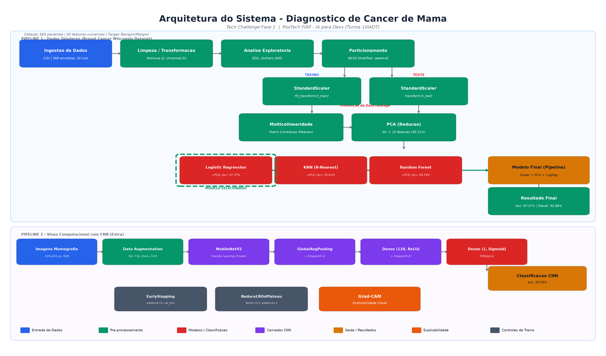

# 10IADT — Tech Challenge (Fase 1)

Modelo para diagnóstico do câncer de mama. Notebook único: `tech_challenge_fase1.ipynb`.

## Como rodar

### Opção 1 — Docker

```bash
docker build -t tech-challenge-fase1 .
docker run --rm -p 8888:8888 -v "$(pwd):/app" tech-challenge-fase1
```

Acesse `http://localhost:8888` e abra `tech_challenge_fase1.ipynb`.

### Opção 2 — Python local

```bash
python -m venv .venv
source .venv/Scripts/activate     # Linux/Mac: source .venv/bin/activate
pip install -r requirements.txt
jupyter notebook
```
### Arquitetura 


O sistema e composto por dois pipelines complementares para classificacao de tumores mamarios:


### Pipeline 1 — Dados Tabulares


Processa o dataset [Breast Cancer Wisconsin](https://www.kaggle.com/datasets/uciml/breast-cancer-wisconsin-data) (569 amostras, 30 features numericas) em etapas sequenciais:


| Etapa | Descricao |

|-------|-----------|

| **Ingestao** | Carregamento do CSV com 569 instancias e 33 colunas |

| **Limpeza** | Remocao de colunas irrelevantes (`id`, `Unnamed:32`) e mapeamento do target (`M` → Maligno, `B` → Benigno) |

| **EDA** | Analise exploratoria com distribuicao de classes, histogramas e deteccao de outliers via IQR |

| **Particionamento** | Divisao 80/20 estratificada (`random_state=42`) preservando proporcao de classes |

| **Padronizacao** | `StandardScaler` aplicado separadamente em treino (`fit_transform`) e teste (`transform`) para prevenir data leakage |

| **Multicolinearidade** | Matriz de correlacao (Pearson) identifica redundancias entre features |

| **PCA** | Reducao de 30 para 10 componentes principais, preservando 95.21% da variancia |

| **Modelagem** | Avaliacao comparativa de Logistic Regression, KNN e Random Forest (com e sem PCA) |

| **Modelo Final** | Pipeline `StandardScaler` → `PCA` → `Logistic Regression` encapsulado via `sklearn.pipeline.Pipeline` |


**Resultados:** Acuracia de **97.37%** e Recall de **92.86%** para tumores malignos, com zero falsos positivos.


### Pipeline 2 — Visao Computacional com CNN (Extra)


Demonstra a viabilidade de classificacao por imagens de mamografia usando Transfer Learning:


| Componente | Descricao |

|------------|-----------|

| **Entrada** | Imagens 224x224 RGB |

| **Data Augmentation** | Rotacao, flip horizontal, zoom e shift para aumentar dataset de treino |

| **Backbone** | MobileNetV2 pre-treinado (ImageNet), com pesos congelados |

| **Classificador** | GlobalAveragePooling2D → Dropout(0.3) → Dense(128, ReLU) → Dropout(0.2) → Dense(1, Sigmoid) |

| **Callbacks** | `EarlyStopping` (patience=5) e `ReduceLROnPlateau` (factor=0.5) |

| **Explicabilidade** | Grad-CAM para visualizar regioes de atencao da rede |


**Resultado:** Acuracia de **95.00%** no conjunto de teste.


### Tecnologias Utilizadas


- **Python 3.x** — Linguagem principal

- **pandas / numpy** — Manipulacao e analise de dados

- **matplotlib / seaborn** — Visualizacao de dados

- **scikit-learn** — Machine Learning (StandardScaler, PCA, LogisticRegression, KNN, RandomForest, Pipeline)

- **TensorFlow / Keras** — Deep Learning (MobileNetV2, Transfer Learning)

- **OpenCV** — Processamento de imagens e Grad-CAM

- **scipy** — Testes estatisticos (Shapiro-Wilk)
